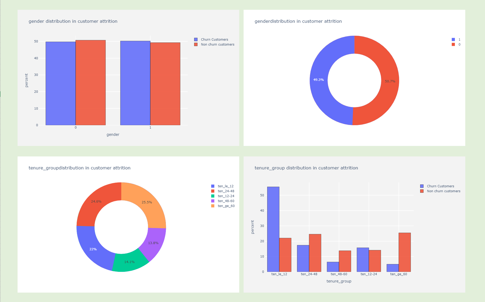
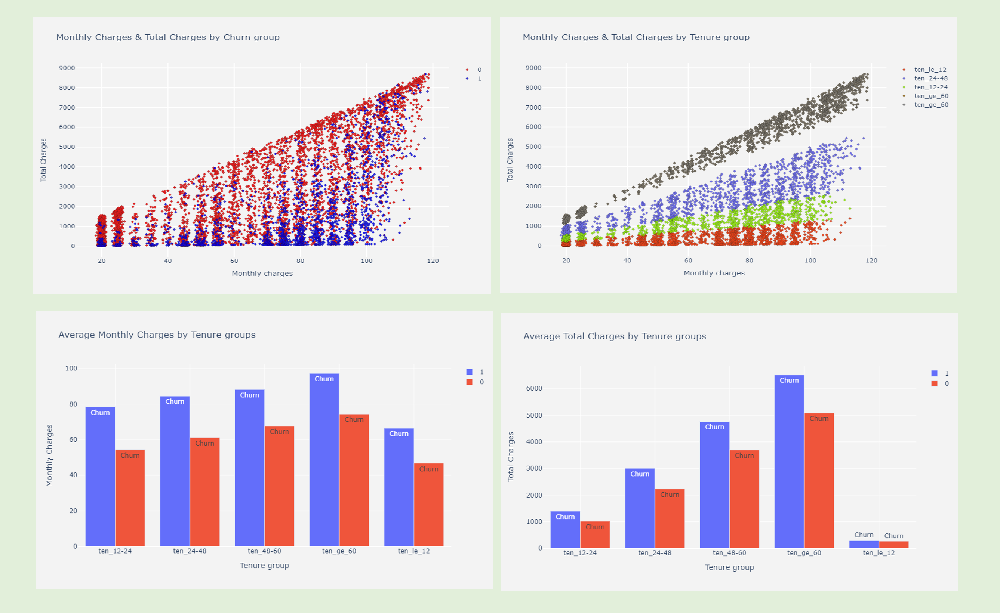
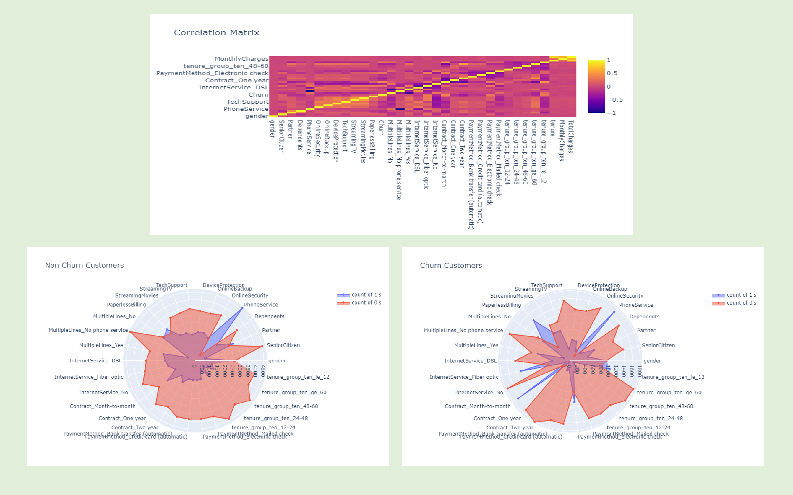
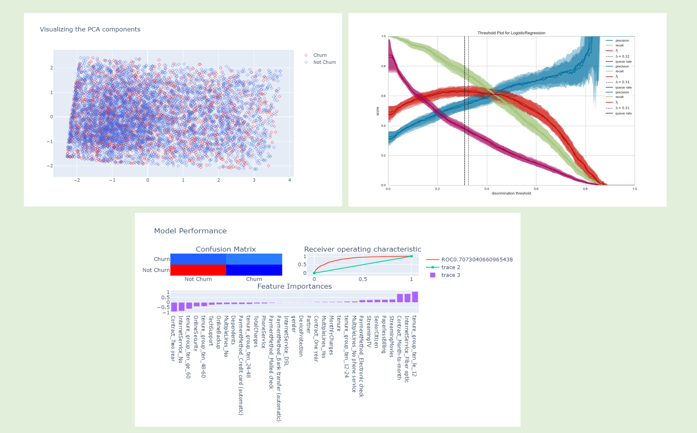

Telco Customer Churn Analysis
==============================
<!-- PROJECT LOGO -->
 

  

Analysis of IBM telco-customer churn.

This project focusses on doing descriptive analysis and creating rich visualization to be presented to stakeholders. IT further creates a simple logistic regression model with statistical significance to classify customers into churn and non-churn groups. The insights generated from this EDA are used to create data driven strategic recommendations to retain customers who are potential candidate to churn in coming month. 

## Project Organization
------------

    ├── README.md          <- The top-level README for developers using this project.
	├── readme-assets      <- Contains images to be used in README.md
    ├── data
    │   └── raw            <- The original, immutable data dump.
    │
    ├── notebooks          <- Jupyter notebooks for downloading dataset, carrying out EDA and building recommendation system
    │
    ├── reports            <- Generated analysis as PDF.
    │   └── figures        <- Generated graphics and figures to be used in reporting
	├── requirements.txt   <- The requirements file for reproducing the analysis environment, 
								e.g. generated with `pip freeze > requirements.txt`

--------

## Analysis
------------

### EDA

  

  

  

### Model

  

Ackowledgements
------------
* [IBM](https://www.ibm.com/docs/en/cognos-analytics/11.1.0?topic=samples-telco-customer-churn)
--------